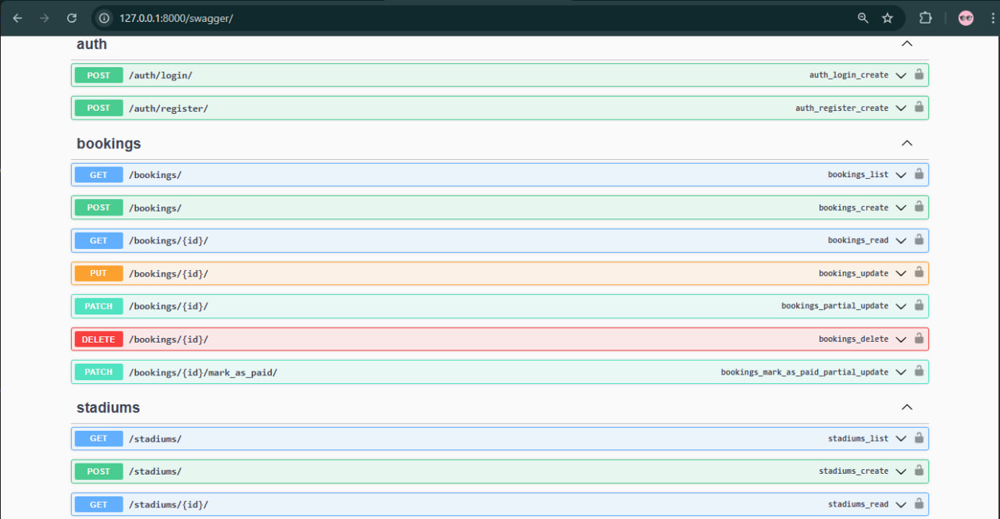

# ⚽ StreetSport API

StreetSport API — bu Toshkent shahridagi stadionlarni bron qilish tizimi uchun RESTful API. Ushbu API foydalanuvchilarga stadionlarni ko‘rish, bron qilish, to‘lovlarni amalga oshirish va boshqarish imkoniyatlarini yaratadi. API foydalanuvchilarga turli rollar asosida (Admin, Owner, User) ruxsatlar beradi.

## ⚙️ Texnologiyalar

- **Backend**: Django + DRF (REST API)
- **Database**: PostgreSQL
- **Authentication**: JWT (JSON Web Tokens)
- **API Documentation**: Swagger UI (drf-yasg)

## 📦 Asosiy funksiyalar

### 🌍 Stadionlar
- Har bir foydalanuvchining o‘ziga tegishli stadionlari mavjud.
- Adminlar barcha stadionlarni ko‘rish va boshqarish imkoniyatiga ega.
- Ownerlar faqat o‘z stadionlarini boshqarishi mumkin.

### 📅 Bron qilish
- Foydalanuvchilar stadionlarda bron qilishni amalga oshirishi mumkin.
- Har bir foydalanuvchi o‘zining bronlarini ko‘rishi va boshqarishi mumkin.
- Adminlar barcha bronlarni ko‘rish va boshqarish imkoniyatiga ega.
- Bronlar uchun to‘lovlarni "to‘langan" yoki "to‘lanmagan" deb belgilash imkoniyati.

### 🛠️ Boshqaruv
- Adminlar va ownerlar o‘z stadionlarini boshqarish, manajer tayinlash va o‘zgartirishlar kiritish imkoniyatiga ega.
- Adminlar barcha foydalanuvchi va stadionlarni boshqarish huquqiga ega.

### 🔐 Ro‘yxatdan o‘tish va Kirish
- Foydalanuvchilar ro‘yxatdan o‘tib, tizimga kirishlari mumkin.
- Login uchun JWT token ishlatiladi.

## 📷 Ekranlar



## 🚀 Ishga tushirish

### 1. Repository-ni klonlash:
```bash
git clone https://github.com/username/street-sport-booking-system-api.git
cd streetsport-api
```
### 2. Virtual muhit va kutubxonalarni o‘rnatish:
```bash
python -m venv venv
source venv/bin/activate  # Windows: venv\Scripts\activate
pip install -r requirements.txt
```
### 3. Django migratsiyalar va admin foydalanuvchi:
```bash
python manage.py migrate
python manage.py createsuperuser
```
### 4. Serverni ishga tushirish:
```bash
python manage.py runserver
```

## 👤 Muallif

**Ism:** Sardor  
**Telegram:** [@imsafarov](https://t.me/imsafarov)


MIT License

Copyright (c) 2025 Sardor
